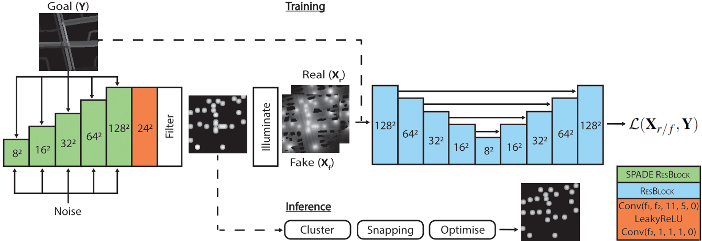

# A Generative Approach to Light Placement for Street Lighting

This repository contains the source code for the short paper: *[A Generative Approach to Light Placement for Street Lighting](https://diglib.eg.org/handle/10.2312/egs20241031)*, presented at the **[Eurographics 2024](https://eg2024.cyens.org.cy/)** conference.

## Table of Contents

- [Prerequisites](#prerequisites)
- [Downloading the Dataset](#downloading-the-dataset)
- [Training the Model](#training-the-model)
- [Testing the Model](#testing-the-model)
- [How to Cite](#how-to-cite)
- [Acknowledgments](#acknowledgments)
- [Contact Us](#contact-us)

## Prerequisites

The code has been tested on **Python 3.9** and is accombanied with a ``requirements.txt`` including all dependencies.

## Downloading the Dataset
The dataset used in the paper is available *[here](https://cloud.aueb.gr/index.php/s/rNBns9CLzNWBNfi)*. Download and extract it at the root folder of the project.

To inspect the contents of the dataset navigate to ``lotus_dataloader.py``.

## Training the Model
The code is configured to be trained as proposed in the main paper. To instantiate your own training, navigate to ``main.py`` script and call the ``modelTrain()`` function. Calling the training routine, will automatically create a folder in ``plots/your_model_name`` caching all relevant meta data during training.

The file [`lotus_config.py`](global_config.py) contains a set of hyperparameters that are used to tune the network. The default parameters are also used in the main paper.

Some extra information:
- You may resume training when creating the model by appropriately setting the argument in ``model.buildModel()``. Please note that this function loads the last recorded model parameters and optimizer's state from ``meta`` directory and appends the statistics cached in the ``plots/your_model_name`` existing directory

- The ``meta`` folder contains the model from the last recorded epoch and a checkpoint of the best recorded model in terms of mean absolute error (see paper) with the name ``your_model_name_cp``.

## Testing the Model

To test the trained network there two options. First, on the best recorded checkpoint or second, from a specific checkpoint located in ``plots/your_model_name/checkpoints``. Then, navigate to ``main.py`` script and call the ``modelTest()`` function. To load a specific model, copy the model cached state to ``meta/your_model_name`` and name the file equal to the name variable you used to instantiate ``modelTest()`` function. Additionally during testing there are the following options available:

- ``PLOT_GENERATOR``: Plot seeds from the generator 
- ``PLOT_POSTPROCESS``: Plot seeds from the generator including the post-process step (see paper) 
- ``EVAL_MODEL``: Export several ``.csv`` files with detailed metrics per block in the subset at directory ``plots/your_model_name/evaluation``
- ``EXPORT_LIGHTS``: Exports a ``plots/your_model_name/predicted_lights.json`` file with the light spatial locations (relative to block dimensions) and their respective intensities

## How to Cite
If you use the contents of this repository for your work, please cite it as described below:

<blockquote>
<pre style="white-space:pre-wrap;">
In our work, we have used the source code~\cite{Evangelou_EG_2023}, available at <em>' https://github.com/cgaueb/streetGAN'</em>.
</pre>

<pre style="white-space:pre-wrap;">
@inproceedings {10.2312:egs.20241031,
	booktitle = {Eurographics 2024 - Short Papers},
	editor = {Hu, Ruizhen and Charalambous, Panayiotis},
	title = {{A Generative Approach to Light Placement for Street Lighting}},
	author = {Evangelou, Iordanis and Vitsas, Nick and Papaioannou, Georgios and Gkaravelis, Anastasios},
	year = {2024},
	publisher = {The Eurographics Association},
	ISSN = {1017-4656},
	ISBN = {978-3-03868-237-0},
	DOI = {10.2312/egs.20241031}
}
</pre>
</blockquote>

## Acknowledgments
This research was funded by the Hellenic Foundation for Research and Innovation (HFRI) under the “3rd Call for H.F.R.I. Research Projects to support Post-Doctoral Researchers” (Project No: 7310, <a href="https://lotus.aueb.gr">LOTUS</a>).

Credits for the datasets:

- [Open Street Map](https://www.openstreetmap.org/#map=14/38.8981/-77.0116)

- [Open data DC](https://opendata.dc.gov/datasets/street-lights)

## Contact Us
For any assistance, please contact me at iordanise@aueb.gr. Thank you!
